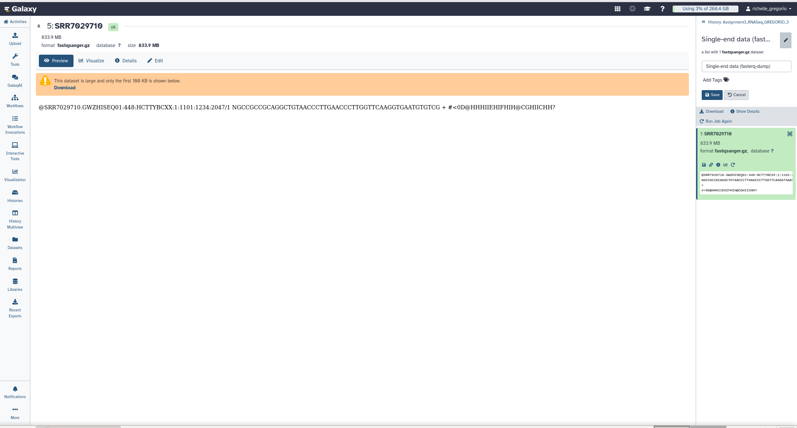
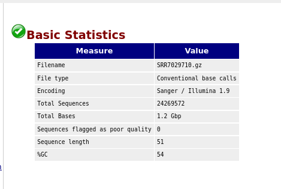
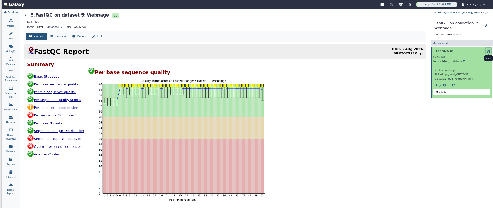
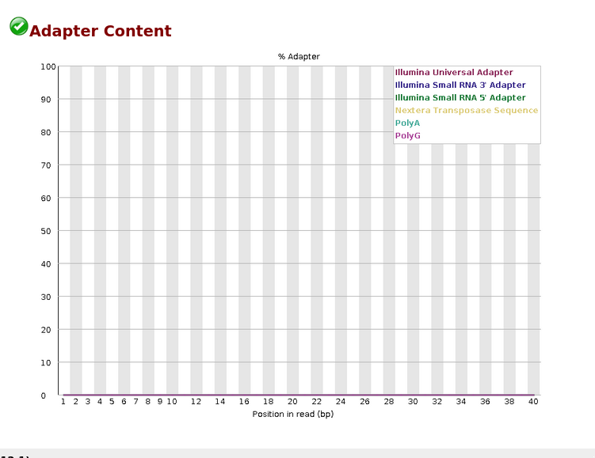

# GREGORIO, RICHELLE O. (RNA-SEQ DATASET DOCUMENTATION)

Student: Gregorio, Richelle O.  
Group: 3 - Infection

---

## Group Paper

### Title

*Salmonella Typhi Colonization Provokes Extensive Transcriptional Changes Aimed at Evading Host Mucosal Immune Defense During Early Infection of Human Intestinal Tissue*

### Citation

Nickerson KP, Senger S, Zhang Y, Lima R, Patel S, Ingano L, Flavahan WA, Kumar DKV, Fraser CM, Faherty CS, Sztein MB, Fiorentino M, Fasano A. *Salmonella Typhi Colonization Provokes Extensive Transcriptional Changes Aimed at Evading Host Mucosal Immune Defense During Early Infection of Human Intestinal Tissue.* EBioMedicine. 2018 May;31:92-109. doi: 10.1016/j.ebiom.2018.04.005. Epub 2018 Apr 12. PMID: 29735417; PMCID: PMC6013756.

---

# Assigned RNA-Seq Sample

### RNA-Seq Dataset Information

| RNA-Seq Characteristic | Observation |
|---|---|
| RNA-seq run accession | [SRR7029710](https://trace.ncbi.nlm.nih.gov/Traces/sra?run=SRR7029710) |
| Condition | Bacterial Culture |
| Biological representation | Cultured *Salmonella Typhi* bacteria during growth in culture |
| Sequencing type | Single-end |
| Number of reads / sequences | 24,269,572 |
| Read length | 51 bp |
| File size | 833.9 MB |
| Total bases | 1.2 Gbp |
| GC content | 54% |

### Biological Representation of the Sample

The sample represents cultured *Salmonella Typhi* bacteria grown under bacterial culture conditions, providing RNA-seq data that reflects the gene expression profile of the bacteria during growth in culture.

---

# FastQC Results

FastQC was used to assess the quality of the SRR7029710 RNA-seq reads.

| FastQC Parameter | Result / Observation |
|---|---|
| Basic Statistics | PASS |
| Per Base Sequence Quality | PASS |
| Per Tile Sequence Quality | PASS  |
| Per Sequence Quality Scores | PASS |
| Per Base Sequence Content | WARNING – Some variation in nucleotide composition was observed across the read positions. |
| Per Sequence GC Content | FAIL – The GC-content distribution differed from the expected pattern. |
| Per Base N Content | PASS  |
| Sequence Length Distribution | PASS |
| Sequence Duplication Levels | FAIL – A high level of duplicated sequences was detected. |
| Overrepresented Sequences | FAIL – Several sequences were present at higher frequencies than expected. |
| Adapter Content | PASS – No significant adapter contamination was detected. |

---

# FastQC Summary

The FastQC results showed that the RNA-seq dataset had generally good sequence quality. Basic statistics, per-base sequence quality, per-tile sequence quality, per-sequence quality scores, per-base N content, sequence length distribution, and adapter content all passed. However, per-base sequence content received a warning, while per-sequence GC content, sequence duplication levels, and overrepresented sequences failed the quality checks. These results indicate some variation in nucleotide composition, an unusual GC distribution, duplicated reads, and overrepresented sequences that should be considered during downstream analysis.

---

# Screenshots

The following screenshots document the assigned RNA-seq dataset and FastQC analysis of SRR7029710.

## Figure 1. Preview of the Assigned RNA-Seq Dataset

Figure 1. Preview of the assigned RNA-seq dataset SRR7029710 in Galaxy.

The figure shows the imported SRR7029710 RNA-seq dataset in Galaxy. The dataset is in compressed FASTQ format (`fastqsanger.gz`) with a file size of 833.9 MB. The preview displays the sequencing read information from the assigned sample.

---

## Figure 2. Basic Statistics

Figure 2. Basic sequencing statistics for SRR7029710.

The figure shows 24,269,572 total sequences and approximately 1.2 Gbp of total bases. The reads are 51 bp long, have 54% GC content, and 0 sequences were flagged as poor quality.

---

## Figure 3. Per Base Sequence Quality

Figure 3. Per-base sequence quality of the RNA-seq reads.

The figure shows high quality scores across most of the 51-bp reads, with Phred scores generally around 35–39, indicating good sequence quality. The first few bases have slightly lower scores, but the overall quality remains high and the FastQC check passed.

---

## Figure 4. Adapter Content

Figure 4. Adapter content detected in the RNA-seq reads.

The figure shows very low or near-zero adapter content across the read positions. No significant adapter contamination was detected, resulting in a PASS for the Adapter Content FastQC check.

---

## Conclusion

The RNA-seq dataset SRR7029710 contains 24,269,572 single-end reads, each 51 bp long, with a 54% GC content. The FastQC analysis shows that the reads are generally of good quality, with high per-base sequence quality and no significant adapter contamination. However, the dataset showed a warning for per-base sequence content and failed the per-sequence GC content, sequence duplication levels, and overrepresented sequences checks. Overall, SRR7029710 has generally good sequencing quality and can be used for downstream RNA-seq analysis, while the GC-content, duplication, and overrepresented-sequence issues should also be considered when interpreting the data.
