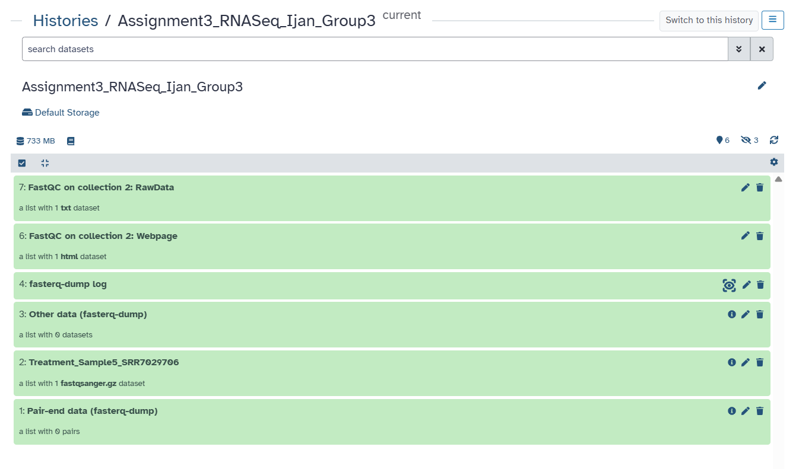
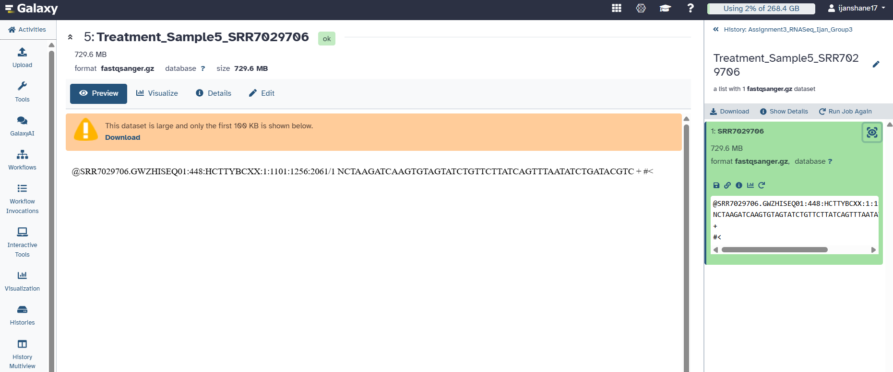
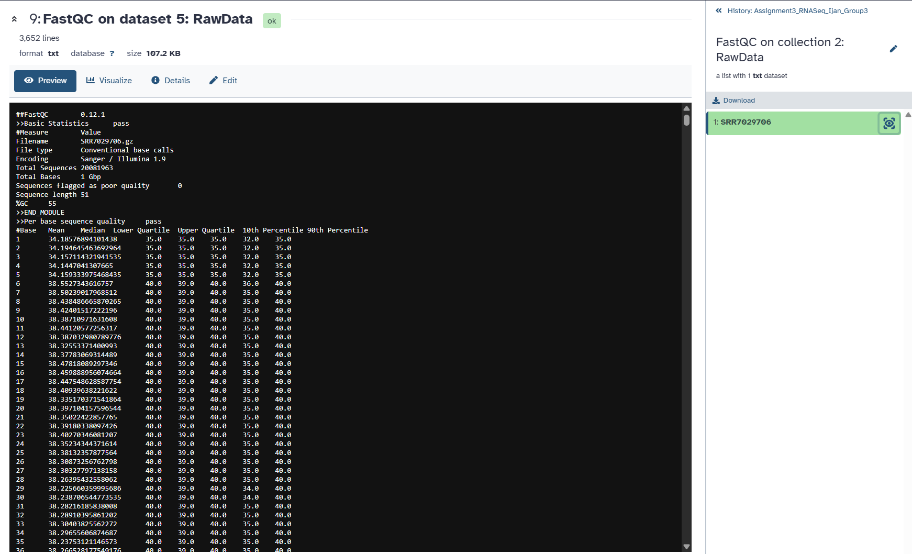
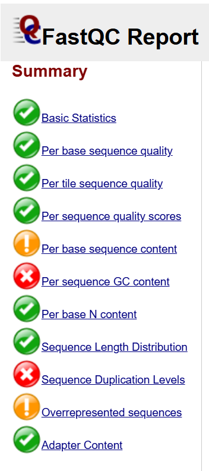
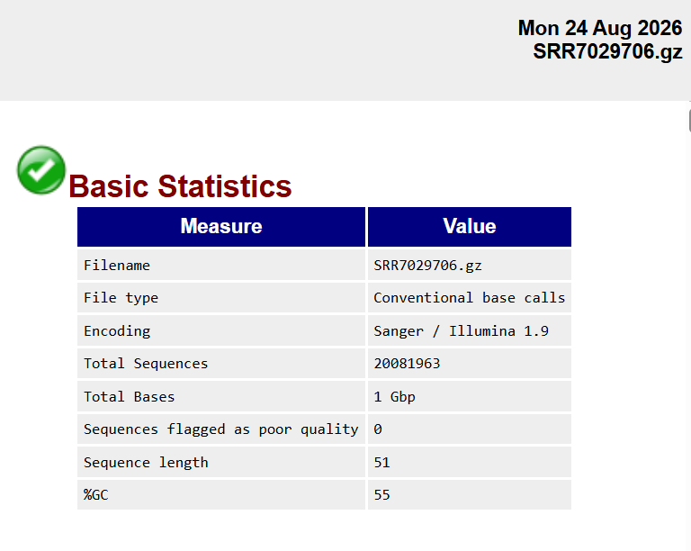
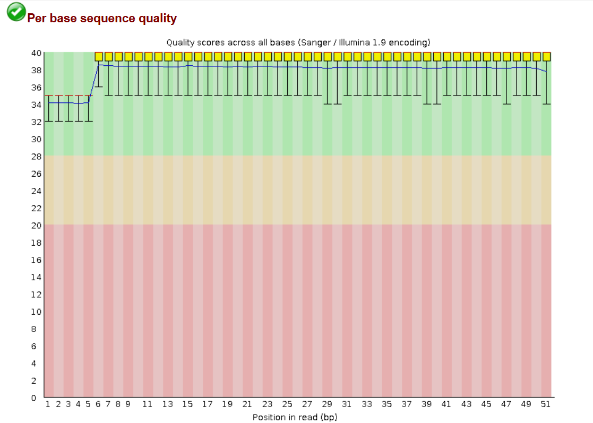
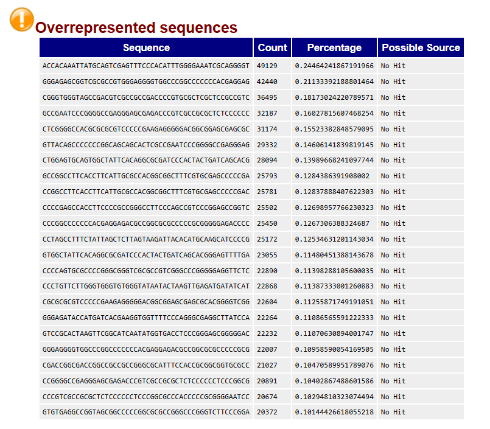
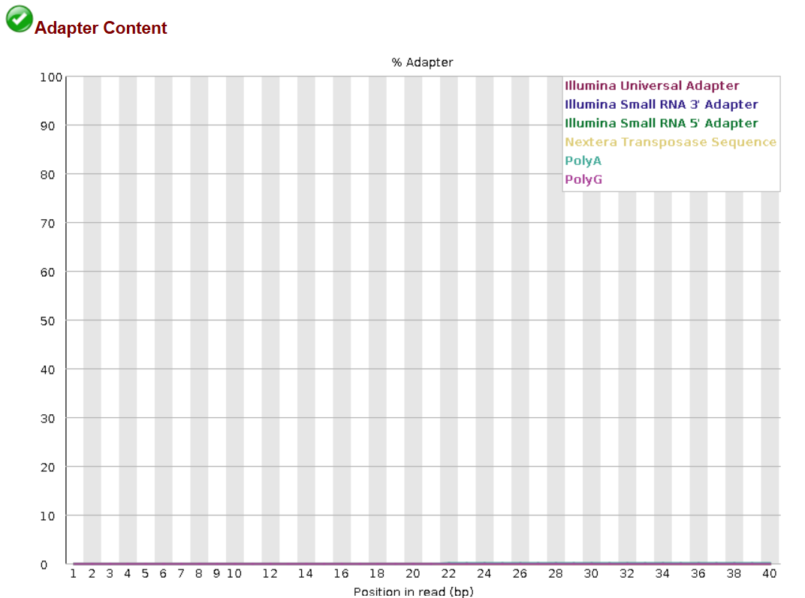
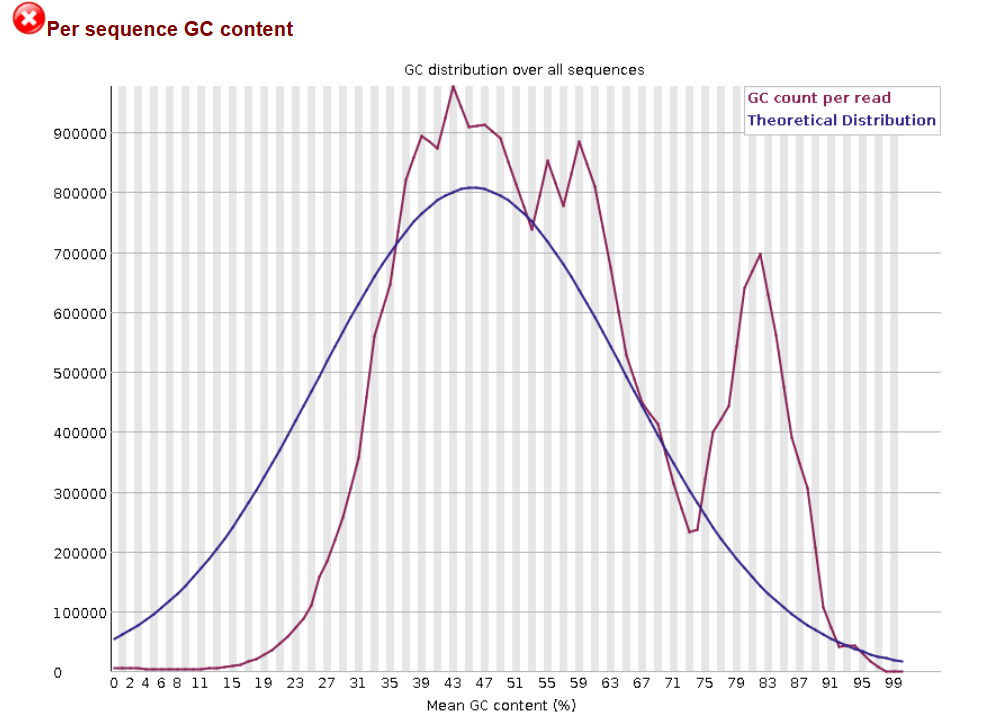
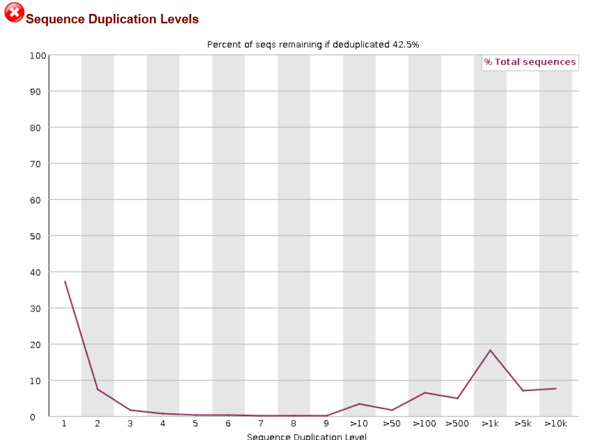

# Screenshots and Interpretation

This folder contains screenshots from the Galaxy RNA-seq data import and FastQC quality assessment of the assigned dataset, **SRR7029706**. The Faster Download and Extract Reads in FASTQ tool was used to retrieve the sequencing data using the run accession number, while FastQC was used to assess the quality of the sequencing reads.

---

## Figure 1. Galaxy History

**Figure 1.** Galaxy history showing the imported RNA-seq dataset and FastQC analysis of SRR7029706.

The Galaxy history shows the workflow used to import and analyze the assigned RNA-seq dataset, SRR7029706. The Faster Download and Extract Reads in FASTQ tool was used to retrieve the sequencing data using the run accession number. The imported FASTQ dataset was then analyzed using FastQC to assess the overall quality of the sequencing reads. The completed datasets shown in green indicate that the tools ran successfully.

---

## Figure 2. FASTQ Preview

**Figure 2.** FASTQ preview of the SRR7029706 RNA-seq dataset in Galaxy.

The preview shows the structure of a sequencing read from the SRR7029706 dataset in FASTQ format. Each FASTQ record consists of four lines: the sequence identifier beginning with `@`, the nucleotide sequence, the `+` separator, and the quality-score line. This confirms that the imported dataset is in FASTQ format and contains both the nucleotide sequences and their corresponding sequencing quality information.

---

## Figure 3. FastQC Raw Data

**Figure 3.** FastQC RawData results for the SRR7029706 RNA-seq dataset.

The FastQC RawData provides the numerical quality information for the SRR7029706 dataset. It shows a total of 20,081,963 sequences, a read length of 51 bp, and a GC content of 55%, with no sequences flagged as poor quality. The per-base sequence quality also passed, with mean Phred scores generally above Q30, indicating high-quality sequencing reads.

---

## Figure 4. FastQC Summary

**Figure 4.** FastQC summary of the quality assessment for the SRR7029706 RNA-seq dataset.

The FastQC summary shows that most quality checks passed, including basic statistics, per-base sequence quality, per-tile sequence quality, per-sequence quality scores, per-base N content, sequence length distribution, and adapter content. Warnings were observed for per-base sequence content and overrepresented sequences, while per-sequence GC content and sequence duplication levels failed. Overall, the dataset shows good sequencing quality, but the warnings and failed checks indicate unusual sequence composition and high duplication that should be considered during further analysis.

---

## Figure 5. FastQC Basic Statistics

**Figure 5.** FastQC basic statistics for the SRR7029706 RNA-seq dataset.

The FastQC basic statistics show that the SRR7029706 dataset contains 20,081,963 sequences, with a fixed read length of 51 bp and a GC content of 55%. The dataset contains approximately 1 Gbp of sequence data, and no sequences were flagged as poor quality. The green PASS (✓) symbol indicates that the Basic Statistics module completed without quality concerns.

---

## Figure 6. Per-Base Sequence Quality

**Figure 6.** FastQC per-base sequence quality of the SRR7029706 RNA-seq dataset.

The per-base sequence quality plot shows that the reads had high quality across all 51 base positions. The mean Phred quality scores were approximately Q34 at the first few bases and increased to around Q38–Q39 for most of the remaining positions. All positions remained within the green high-quality region, and the module received a PASS (✓) result. This indicates that the sequencing reads have good base-call accuracy and are generally suitable for further analysis.

---

## Figure 7. Overrepresented Sequences

**Figure 7.** FastQC overrepresented sequences detected in the SRR7029706 RNA-seq dataset.

FastQC detected several sequences that occurred more frequently than expected, resulting in a WARNING (!) for overrepresented sequences. Each individual sequence represents only a small percentage of the total reads, with the most abundant sequence accounting for approximately 0.24%. FastQC identified their possible sources as "No Hit" which means they were not matched to a known source in the FastQC database. These overrepresented sequences may reflect characteristics of the RNA-seq library and should be considered during further analysis.

---

## Figure 8. Adapter Content

**Figure 8.** FastQC adapter content analysis of the SRR7029706 RNA-seq dataset.

The adapter content remained near 0% across the reads, and this FastQC module received a PASS (✓) result. This indicates that no significant adapter contamination was detected in the dataset. Therefore, adapter sequences are unlikely to have a major effect on the quality of the reads or subsequent analysis.

---

## Figure 9. Per-Sequence GC Content

**Figure 9.** FastQC per-sequence GC content of the SRR7029706 RNA-seq dataset.

The observed GC distribution differs from the theoretical distribution, resulting in a FAIL (✗) result in FastQC. The graph shows several peaks rather than a single smooth distribution, indicating that the reads do not have a uniform GC composition. This may reflect different groups of RNA sequences present in the sample or other sequence-specific biases. Therefore, the unusual GC distribution should be considered during further analysis, although it does not automatically mean that the sequencing data are unusable.

---

## Figure 10. Sequence Duplication Levels

**Figure 10.** FastQC sequence duplication levels of the SRR7029706 RNA-seq dataset.

The sequence duplication analysis received a FAIL (✗) result in FastQC. The report indicates that approximately 42.5% of the sequences would remain after deduplication*, showing that a considerable portion of the reads are duplicated. In RNA-seq data, some duplication can occur naturally because highly expressed genes can produce many identical or similar reads. However, the high duplication level may also indicate sequencing or library-related bias, so this result should be considered during further analysis.
